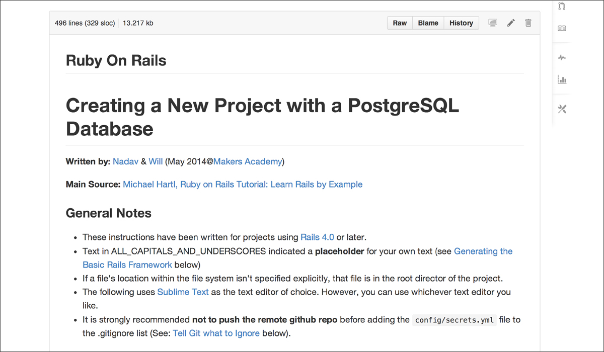
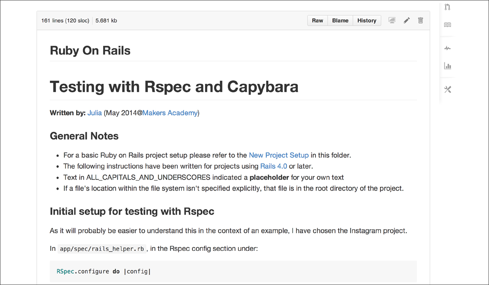
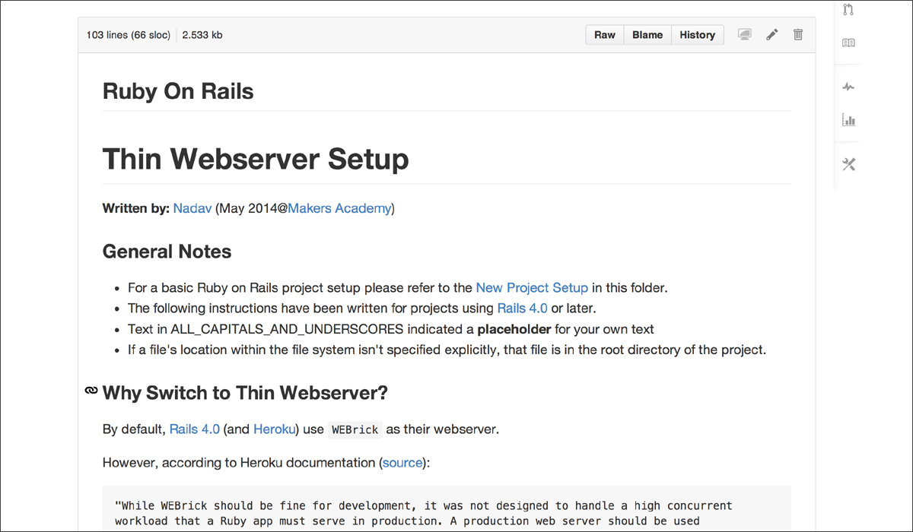
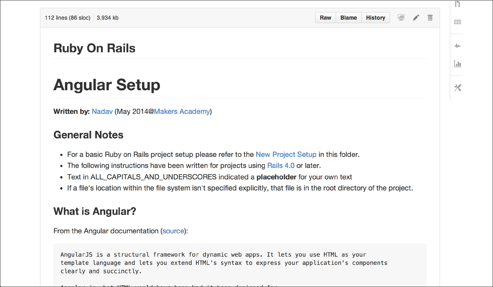

#The Great Book of Walkthroughs 
####(in the making...)

## Table of Contents

* [Screenshots](#screenshots)
* [Introduction](#introduction)
* [Guidelines](#guidelines)
* [Current Walkthroughs](#current-walkthroughs)
* [Still Pending](#still-pending)
* [Suggested Topics](#suggested-topics)
* [Contributors](#contributors)

## Screenshots

<table>
	<tr>
		<td align="center" width="190px" >
			<a href="https://raw.githubusercontent.com/nadavmatalon/great_book_of_walkthroughs/master/images/great_book_1.jpg">
				
				New Project Setup
			</a>
		</td>
		<td align="center" width="190px" >
			<a href="https://raw.githubusercontent.com/nadavmatalon/great_book_of_walkthroughs/master/images/great_book_2.jpg">
				
				Rspec & Capybara
			</a>
		</td>
      <td align="center" width="190px" >
         <a href="https://raw.githubusercontent.com/nadavmatalon/great_book_of_walkthroughs/master/images/great_book_3.jpg">
            
            Thin Webserver
         </a>
      </td>
      <td align="center" width="190px" >
         <a href="https://raw.githubusercontent.com/nadavmatalon/great_book_of_walkthroughs/master/images/great_book_4.jpg">
            
            Angular Setup
         </a>
      </td>
	</tr>
</table>

##  Introduction

Taking the first steps in any new development domain - be it Ruby, Javascript or Ruby 
on Rails - is often the hardest part. Walkthroughs are a great way to facilitate the transition 
from this initial (clueless) phase to a more productive & efficient level of competance.

So, here's the big idea in a nutshell: rather than having each of us spending hours 
poring over every available the screen-casts, skimming through countless websites, while 
making our own private notes, we can combine forces and create an extensive repository of 
alkthroughs.

Each one of the walkthroughs is meant to ofer a succict, step-by-step guidance on a 
specific topics, coupled with useful tips, pitfall warnings and perhaps a few selected 
resources.
 

Beyond its substantial time-saving potential and capacity to serve as an effective 
learning-tool for those who take part in writing it, the Great Book of Walkthroughs could 
lso be our gift to the next generations of cohorts at Makers Academy.

## Guidelines

   (to be imporved, revised, updated, and changed in any odd way according to everyone's 
suggestions)  

* __Getting Started__  
   To get started simply pick a topic, preferably one that hasn't been covered yet and 
let me know so I'll update the list on this page.

* __Choosing a Topic__  
   The walkthough topic can be anything you like, from generic ones like "Setting Up a 
New Project in Ruby on Rails" or "Setting Up a Ruby Project with Sinatra", 
to example-specific ones like "Using the Github API".  

   The [Current Walkthroughs](#current-walkthroughs), [Still Pending](#still-pending) & [Suggested   Topics](#suggested-topics) sections below list all the topics which have either been written on or 
already selected, as well as a few open suggestions (but, once again, you can choose to write about 
anything you like regardless of these suggestions).  

* __Resources__  
   It's probably also a good idea to take a look at the various pills & walkthroughs 
available on the Maker's website. If there's an excellent walkthough there already, 
there may not be a need to write a new one (but do send me a link and we'll possibly 
make a list of those for reference).   

   Another potential resouce is simply to follow one of the many available 
screen-casts and iterate each of the steps as they come. In this context, 
some subsequent editing might be needed in order to make the content generic so that 
it'll be useful for other project as well.

* __Availability__   
   All walkthroughs will be available on this Github repo.  

   To share your walkthrough, simply fork this repository, add your file to the 
walkthroughs folder, push to your remote repo, send me a pull request and I'll 
merge it into the general repo.  

* __What's in a Walkthrough__   
   The walkthroughs themselves need not be long or extensive (though they could be if 
you prefer to write them that way), nor should they take long to write. The idea is to 
provide just the basic squence of little steps to guide someone who knows little to 
nothing about a particular subject. Alternatively, they could serve as a 'ckecklist' 
to make sure all the necessary steps have been taken.  

   For general referece, you can check out [Ruby on Rails: New Project Setup (with PostgreSQL db)] (walkthroughs/ror_new_project_setup.md) which is located in the "walkthroughs" folder (it 
should be formatted in a nicer way, but overall it should contain all the important steps).  

* __File Format__   
   For now, please use the .md ('markdown') file formats for the walkthroughs.

* __Content__   
   In terms of content the most important thing is to keep to the "step-by-step" paradigm.

   Try to provide succinct yet specific information about where each step is taken 
(terminal, browser, etc - in projects with a large number of files this will be 
particularly helpful). Another example is adding a link-pointer to the Github 
repository of a Gem when the latter is to be included in the Gemfile.

   Also, try to offer a clear distinction between essential steps & optional ones.

* __Testing__   
   The question of how to incorporate testing in these basic walkthroughs is a tricky 
subject. One approach could be to initially leave testing aside and later create 
a complementary doc to accompany the main walkthrough in which a list possible tests 
is given. Another approach may be to combine the testing with the walkthrough itself 
(the difficulty here is that it may requires constant switching and changing between 
Sublime Text, terminal and the browser and therefore become very hard to write up succinctly). 
hopefully we'll come up with good ways of do this as we go along.

* __Timeline__   
   There isn't a specific timeline for all this, but given that it should only take a few h
ours to write a walkthrough, plus the fact that they'll be very useful to all of us in 
the next few weeks, it'd be great if we could create as many of them as we can in the 
comming days.

* __Pair Writing__   
   Another great possiblity for writing a walkthough is to pair up for a few hours and write a walkthrough on a chosen subject together.

* __Feedback__   
   Please let me know about any suggestions, improvements, corrections etc. that you may have :-)

## Current Walkthroughs

The following can be found in the "walkthroughs" folder:  

* [Ruby on Rails: New Project Setup (with PostgreSQL db)] (walkthroughs/ror_new_project_setup.md)
* [Ruby on Rails: Adding Static Pages (Home, About, Contact, Help)] (walkthroughs/ror_adding_static_pages.md)
* [Ruby on Rails: Thin Webserver Setup (Production alternative to WEBrick)] (walkthroughs/ror_thin_webserver_setup.md)
* [Ruby on Rails: Basic Form Creation] (walkthroughs/ror_basic_form_creation.md)
* [Ruby on Rails: Testing with Rspec & Capybara] (walkthroughs/ror_testing_rspec_capybara.md)
* [Ruby on Rails: Deployment to Heroku] (walkthroughs/ror_deployment_to_heroku.md)
* [Ruby on Rails: Angular Setup] (walkthroughs/ror_angular_setup.md)
* [Paperclip (Image Management)] (walkthroughs/ror_paperclip.md)
* [Github: Creating a Project Page] (walkthroughs/github_creating_a_project_page.md)

## Still Pending

(People who promised to write walkthroughs but haven't delivered yet...)  

* Ruby on Rails: Ajax (Fitsum)	
* Ruby on Rails: Amazon S3 (Nicolai)
* Ruby on Rails: Bootstrap (James W.)
* Ruby on Rails: Devise (Faezrah)
* Scraping Websites (Nic)
* Working with Json (Vaidas)
* Rspec with Capybara/Poltergeist (Kate)
* TDD with Capybara (Margherita)
* Ruby on Rails: Partials (Federico)

## Suggested Topics

Pick whatever you like & write a walkthrough:  

* Javascript (general guide / concrete examples)
* APIs (general guide / concrete examples)
* Ruby on Rails: Helpers
* Ruby on Rails: Partials
* Sinatra apps
* Gmaps (Google maps API)
* homebrew
* Active Record: Nested Attributes
* Mustache
* Coffee script
* Flexbox (CSS)

## Contributors

A big thank you to all our contributors:

[    Nadav Matalon] (https://github.com/nadavmatalon)

[    Will Allen] (https://github.com/painted)

<a href= "https://github.com/jchb9">
<a>
[    Johann Bornman] (https://github.com/jchb9)

[    Julia Tan] (https://github.com/juliatan)

[    Julie Ann Walker] (https://github.com/julieannwalker)

